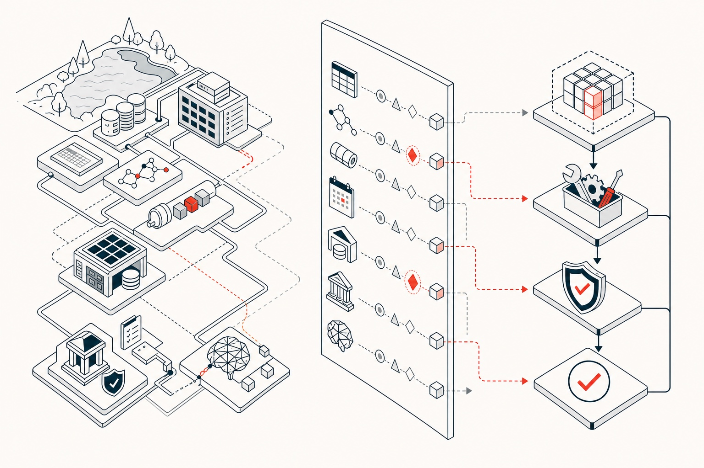
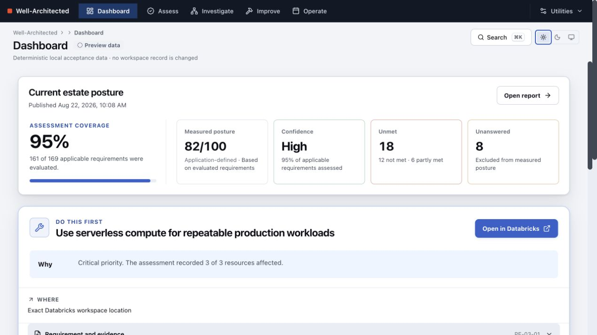
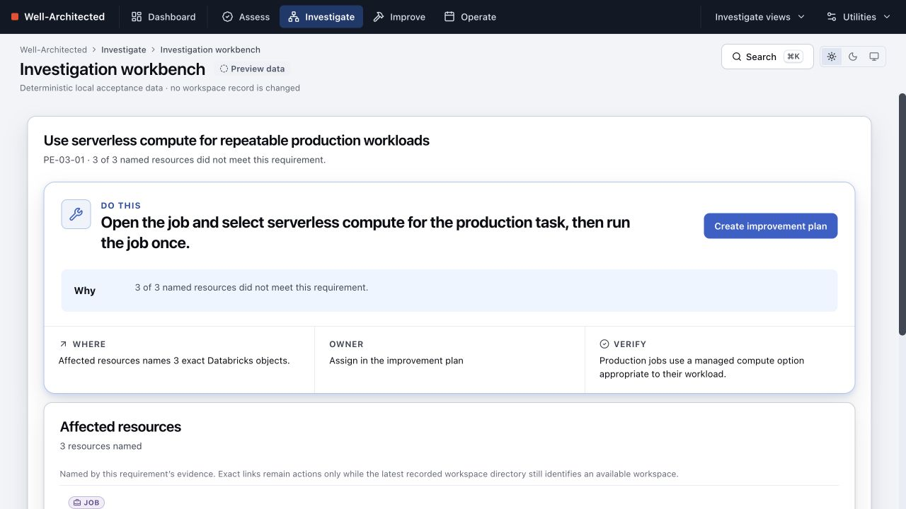
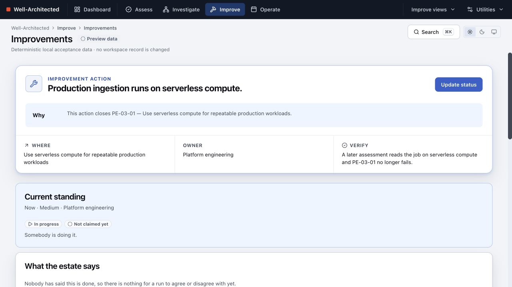
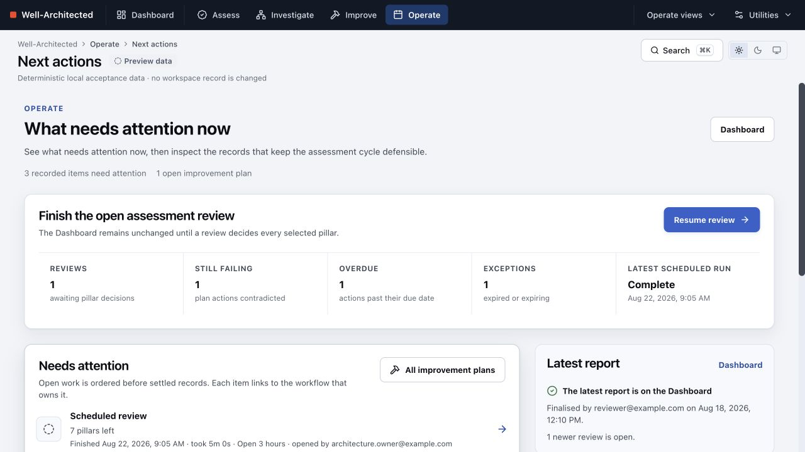
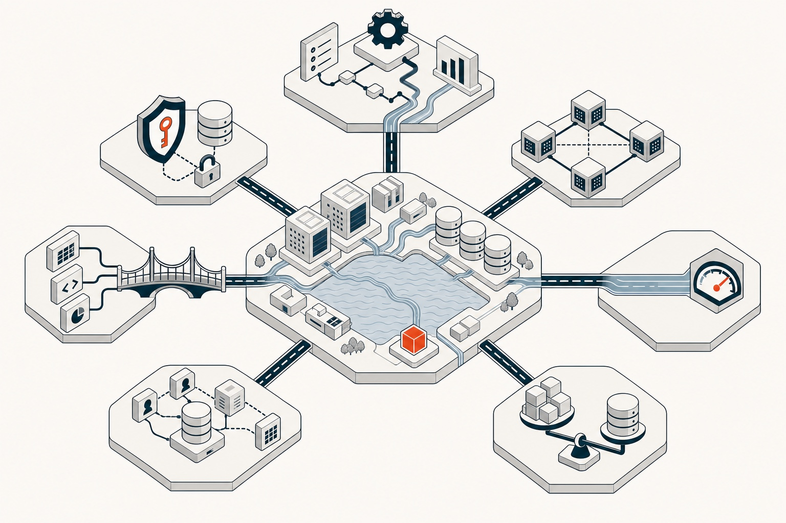

# Databricks Well-Architected Framework assessment

**Find architecture gaps, trace them to evidence, and turn them into owned improvement work.**

[Get started](#get-started) · [Read the guide](https://databricks-solutions.github.io/databricks-waf/) ·
[View v0.1.0 Alpha](https://github.com/databricks-solutions/databricks-waf/releases/tag/v0.1.0) ·
[Report an issue](https://github.com/databricks-solutions/databricks-waf/issues)



Architecture reviews often end with a score or a document. The team is then left to work out where each
issue lives, why it matters, what to change, and how to prove it was fixed. This App keeps that chain intact:

**requirement → evidence → affected resource → action → later verification**

It assesses a workspace or account against the seven pillars of the
[Databricks Well-Architected Framework](https://docs.databricks.com/aws/en/lakehouse-architecture/).
Automated evidence provides an indicative posture immediately. Human review fills only the gaps that
platform data cannot answer. Publication creates an immutable report for governance and comparison.

> **Alpha release:** v0.1.0 is ready for evaluation and field feedback. The supported experience is a
> current desktop or laptop Chrome browser installed through the Databricks Asset Bundle path below.

## What teams get

| Question | Product answer |
| --- | --- |
| Where are we now? | A permanent Dashboard shows posture, evidence coverage, material change, and the next action. |
| Can we trust the result? | Every outcome carries its evidence source, collection time, coverage, and confidence. Not measured never becomes pass. |
| Where is the gap? | Investigate connects an unmet requirement to the workspace resources and evidence that produced it. |
| What should happen next? | Recommendations state the action, the reason, and the relevant Databricks destination. Improvement plans add an owner and verification condition. |
| What changed? | Each eligible run separates new, changed, resolved, regressed, and excepted outcomes. |
| Can we govern the process? | Published reports, answers, decisions, exceptions, plans, and audit history remain in customer-owned Lakebase. |

## One operating loop

| Assess | Investigate | Improve | Operate |
| --- | --- | --- | --- |
| Choose pillars and workspaces, collect evidence, review gaps, and publish. | Start with an unmet requirement, then inspect evidence and affected resources. | Prioritise actions, assign an owner, record the target state, and verify on a later run. | Resume open work, review run history, manage the monthly cycle, and configure scheduling. |

The Dashboard remains the orientation point across the loop. It does not hide low coverage behind a good
score, and it keeps the most important change visible without replacing the evidence behind it.

<table>
  <tr>
    <td width="50%"><strong>Dashboard</strong><br>Posture, coverage, change, and the first action.</td>
    <td width="50%"><strong>Investigate</strong><br>A requirement connected to evidence and resources.</td>
  </tr>
  <tr>
    <td></td>
    <td></td>
  </tr>
  <tr>
    <td><strong>Improve</strong><br>Owned actions with a target state and validation history.</td>
    <td><strong>Operate</strong><br>Open work, assessment history, and the recurring cycle.</td>
  </tr>
  <tr>
    <td></td>
    <td></td>
  </tr>
</table>

## Seven pillars, one evidence model



The same evidence, coverage, action, and verification model applies across all seven official pillars:

| | | |
| --- | --- | --- |
| Operational excellence | Security, privacy, and compliance | Reliability |
| Performance efficiency | Cost optimization | Data and AI governance |
| Interoperability and usability | | |

## Get started

> **Two ways to deploy.** The Databricks Asset Bundle steps below are the supported route, run from a
> laptop or a workspace web terminal. To stay inside the workspace instead, **deploy with Genie Code**:
> give Genie Code the link to this repository (`https://github.com/databricks-solutions/databricks-waf`)
> and ask it to deploy the app into your workspace, and it runs the deployment for you from a notebook by
> following the [Deploy with Genie Code guide](https://databricks-solutions.github.io/databricks-waf/deploy-with-genie-code/).
> That path needs a cluster with shell access and internet egress.

### 1. Check the prerequisites

You need:

- a Databricks workspace with Databricks Apps enabled;
- Databricks CLI 0.292.0 or later and Node.js 22 or later;
- an existing SQL warehouse;
- an existing Lakebase Autoscaling branch and database; and
- a Databricks group whose direct members may run and review assessments.

### 2. Clone the release

```bash
git clone https://github.com/databricks-solutions/databricks-waf.git
cd databricks-waf
git checkout v0.1.0
cd app
npm ci
databricks auth profiles
databricks current-user me --profile <profile>
```

### 3. Bind customer resources

Create the ignored local file `.databricks/bundle/customer/variable-overrides.json` from the `app/`
directory:

```json
{
  "sql_warehouse_id": "<warehouse-id>",
  "postgres_branch": "projects/<project>/branches/<branch>",
  "postgres_database": "projects/<project>/branches/<branch>/databases/<database-id>",
  "assessor_group": "<direct-membership-group>"
}
```

The bundle binds these customer-owned resources. It does not create or delete them.

### 4. Preview, then install

```bash
npm run lifecycle -- validate --profile <profile> --target customer
npm run lifecycle -- install --profile <profile> --target customer
npm run lifecycle -- install --profile <profile> --target customer --apply
```

The lifecycle command validates the DAB, shows the resource plan, deploys and starts the App, verifies
its scopes and bindings, and requires the second plan to contain no changes.

### 5. Run the first assessment

Open the App URL printed by the installer, then:

1. Open **Diagnostics** and resolve any missing access reported by the setup preflight.
2. Select **Define an assessment** and set the purpose, owners, workspaces, lookback window, and pillars.
3. Select **Run assessment**, review the automated evidence, answer the remaining human questions, and
   publish the report.

The scheduled assessment is installed paused and remains opt-in. See the
[installation guide](https://databricks-solutions.github.io/databricks-waf/install/) for resource discovery,
permissions, upgrades, scheduling, backup, recovery, rollback, and uninstall.

## What is measured

<!-- catalogue-counts:start -->

**165 scored controls** across 7 pillars and 31 principles, of which 115 are automatable.

Every control declares where it came from, so the app can answer "is this the actual
Well-Architected Framework?" without hedging:

| Provenance | Controls | Meaning |
| --- | --- | --- |
| `waf-docs` | 113 | A best practice published on a WAF pillar page, carrying a deep link to it. |
| `security-guide` | 66 | A control from the Databricks security guidance that the WAF security pillar page formally delegates to. The pillar page itself documents only four practices and points elsewhere. |
| `extension` | 5 | Authored by this project, not published Databricks guidance. Each carries a rationale and is labelled as an extension in the UI. |

The table counts 184 catalogue entries against 165 scored controls. The difference is requirements that belong to more than one pillar — Delta history
 retention is both a cost concern and a recovery concern — which appear in each and are
 scored once, so overlap cannot inflate the total. The automatable figure above is counted
 the same way; over all 184 entries it is 134.

<!-- catalogue-counts:end -->

## Trust and data boundary

- Assessment reads run on behalf of the signed-in user; collectors use parameterised SQL and read-only
  API routes.
- Mutations require direct membership in the configured assessor group.
- Customer records remain in customer-owned Lakebase. The App never asks for or stores personal access
  tokens.
- The optional AI layer can explain and prioritise findings. It cannot change a finding or score.

Read [the complete security model](SECURITY.md), including the declared API scopes and vulnerability
reporting process.

## Documentation

The [public guide](https://databricks-solutions.github.io/databricks-waf/) is organised around the job you
need to complete:

- [install the App](https://databricks-solutions.github.io/databricks-waf/install/);
- [configure assessment and operation settings](https://databricks-solutions.github.io/databricks-waf/configuration/);
- [run the complete customer journey](https://databricks-solutions.github.io/databricks-waf/user-guide/);
- [understand every page](https://databricks-solutions.github.io/databricks-waf/pages/);
- [operate, recover, upgrade, or uninstall](https://databricks-solutions.github.io/databricks-waf/operations/); and
- [troubleshoot a problem](https://databricks-solutions.github.io/databricks-waf/troubleshooting/).

## Develop and contribute

```bash
cd app
npm ci
npm run dev
npm run verify
```

The app is supported on current desktop and laptop Chrome. See [CONTRIBUTING.md](CONTRIBUTING.md) for the
code, browser, DAB, issue, and pull-request workflow.

## Repository layout

```text
app/                    Databricks App, DAB configuration, source, tests and committed bundle
docs/coverage-ledger.md Control coverage and evidence-path inventory
docs/deployment-lifecycle.md
                        Install, upgrade, recovery, rollback and uninstall runbook
docs/scheduled-scans.md Optional scheduled-identity setup
docs/design/            Customer experience and guidance authoring standards
```

## Licence

&copy; 2026 Databricks, Inc. All rights reserved. The source in this repository is provided subject to
the [Databricks License](https://databricks.com/db-license-source). See [LICENSE.md](LICENSE.md) for
details. Every included third-party package remains subject to its own licence.

The complete production lockfile contains 518 third-party package/version pairs across every optional
runtime platform. All are listed in [THIRD_PARTY_LICENSES.md](THIRD_PARTY_LICENSES.md), and CI refuses a
production dependency whose licence is absent or outside the reviewed allowlist.

<!-- third-party-licenses:start -->
<details>
<summary><strong>Third-party licence summary and direct libraries</strong></summary>

| Licence | Resolved production packages |
| --- | ---: |
| MIT | 362 |
| Apache-2.0 | 97 |
| ISC | 27 |
| BSD-3-Clause | 15 |
| MPL-2.0 | 12 |
| 0BSD | 2 |
| (MPL-2.0 OR Apache-2.0) | 1 |
| BSD-2-Clause | 1 |
| Python-2.0 | 1 |

| Direct third-party library | Version | Licence | Source |
| --- | --- | --- | --- |
| @xyflow/react | 12.11.3 | MIT | [npm](https://www.npmjs.com/package/@xyflow/react/v/12.11.3) |
| clsx | 2.1.1 | MIT | [npm](https://www.npmjs.com/package/clsx/v/2.1.1) |
| embla-carousel-react | 8.6.0 | MIT | [npm](https://www.npmjs.com/package/embla-carousel-react/v/8.6.0) |
| express | 5.2.1 | MIT | [npm](https://www.npmjs.com/package/express/v/5.2.1) |
| js-yaml | 5.4.0 | MIT | [npm](https://www.npmjs.com/package/js-yaml/v/5.4.0) |
| lucide-react | 1.34.0 | ISC | [npm](https://www.npmjs.com/package/lucide-react/v/1.34.0) |
| next-themes | 0.4.6 | MIT | [npm](https://www.npmjs.com/package/next-themes/v/0.4.6) |
| react | 19.2.8 | MIT | [npm](https://www.npmjs.com/package/react/v/19.2.8) |
| react-dom | 19.2.8 | MIT | [npm](https://www.npmjs.com/package/react-dom/v/19.2.8) |
| react-resizable-panels | 4.12.3 | MIT | [npm](https://www.npmjs.com/package/react-resizable-panels/v/4.12.3) |
| react-router | 8.3.0 | MIT | [npm](https://www.npmjs.com/package/react-router/v/8.3.0) |
| tailwind-merge | 3.6.0 | MIT | [npm](https://www.npmjs.com/package/tailwind-merge/v/3.6.0) |
| tailwindcss-animate | 1.0.7 | MIT | [npm](https://www.npmjs.com/package/tailwindcss-animate/v/1.0.7) |
| tw-animate-css | 1.4.0 | MIT | [npm](https://www.npmjs.com/package/tw-animate-css/v/1.4.0) |
| zod | 4.4.3 | MIT | [npm](https://www.npmjs.com/package/zod/v/4.4.3) |

First-party `@databricks/*` packages are governed separately by their published Apache-2.0 terms.

</details>
<!-- third-party-licenses:end -->

This repository begins at a reviewed release baseline. The private development history was deliberately
retained outside the distribution repository so internal workspace details and delivery records are not
part of the public Git history.
